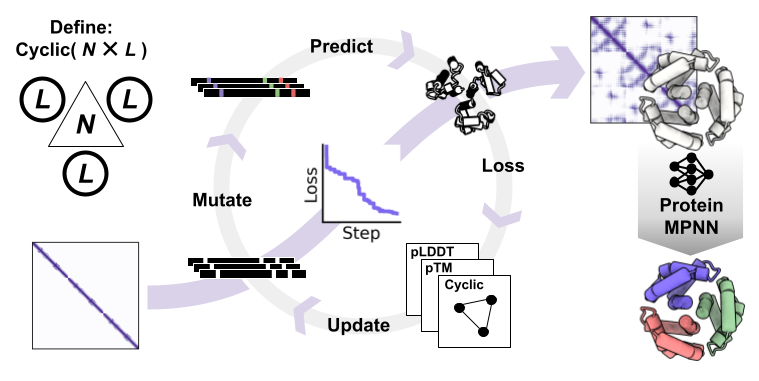

# Oligomer and multi-state hallucination with AlphaFold2

Accompanying [oligomer hallucination paper](https://www.biorxiv.org/content/10.1101/2022.06.09.493773v1) and [ProteinMPNN paper](https://www.biorxiv.org/content/10.1101/2022.06.03.494563v1)


## Summary

- Designs (hallucinations) are performed by MCMC searches in sequence space and optimizing (user-defined) losses composed of AlphaFold2 metrics, and/or geometric constraints, and/or secondary-structure definitions.
- Oligomers with arbitrary number of subunits can be designed.
- Multistate design (either positive or negative) can be specified.
- MCMC trajectories can either be seeded with input sequence(s), or started randomly (using a frequency-adjusted AA distribution).
- At each step, position(s) are chosen for mutation based on different options (see `modules/mutations.py` for details).
- A 'resfile' (`.af2h` extension) can be employed to specify designable positions and associated probabilities of mutation.
- The oligomeric state (number of subunits) for each oligomer (state) can be specified.
- Repeat proteins (sequence-symmetric monomers) can be designed instead of oligomers by passing the `--single_chains` flag. 
- Specific amino acids can be exluded.
- MCMC paramters (initial temperature, annealing half-life, steps, tolerance) can be specified.
- Currently implemented loss functions are (see `modules/losses.py` for details):
  - `plddt`: plDDT seem to have trouble converging to complex formation.
  - `ptm`: pTM tends to 'melt' input structures.
  - `pae`: similar to result as ptm?
  - `dual`: combination of plddt and ptm losses with equal weights.
  - `entropy`: current implementation unlikely to work.
  - `pae_sub_mat`: initially implemented to enforce symmetry, but probably not working.
  - `pae_asym`: this loss has different weights associated with the means of the different PAE sub-matrices (asymmetric weighting of the different inter-chain contacts). Off-diagonal elements (+/-1 from the diagaonl, and opposite corners) have higher weights.
  - `cyclic`: geometric loss term to enforce cyclic symmetry, minimizes the standard deviation of protomer center of mass distances
  - `dual_cyclic`: dual with an added geometric loss term to enforce symmetry. 
  - `frac_dssp`: Enforcing an exact secondary structure percentage (E,H,notEH) as computed by DSSP on the structure.
  - `min_frac_dssp`: Enforcing a minimum fraction of secondary structure content (E,H,notEH). The loss is minimised if the fraction of that secondary strucure (computed by DSSP on the structure) is larger than specified .
  - `tmalign`: loss defined as TM-score to template PDB, given with `--template`, alignment of template (`tmalign -I`) can be forced with `--template_alignment [alignment].aln` if template has multiple chains remove the `TER` in the pdbfiles.
  - `dual_tmalign`: jointly optimises ptm, plddt and tmalign (see above) TM-score.
  - `pae_asym_tmalign`: in development.
  - `aspect_ratio`: geometric term that enforces protomers with aspect ratios close to 1 (i.e. spherical and globular).  


## Minimal inputs

- The number and type of subunits for each oligomer, also indicating whether it is a positive or negative design task.
- The length of each protomer or one seed sequence per protomer.

## Examples

- `./AF2_multistate_hallucination.py --oligo AAAAAA+ --L 30 --loss dual_cyclic --out C6` 

will perform design of an oligomeric assembly six protomers in C6 symmetry, each 30 amino-acids in length.
- `./AF2_multistate_hallucination.py --oligo AAAAAA+ --L 30 --single_chains` 

will perform single-state design of a monomeric repeat proteins containing six repeats, each 30 amino-acids in length.

## Example `.af2h` file

The following config file enables design at all positions set to 1 (equal probability of picking those sites for mutation), and disallow design at all positions that are set to 0.
```
>A
DEEQEKAEEWLKEAEEMLEQAKRAKDEEELLKLLVRLLELSVELAKIIQKTKDEEKKKELLEINKRLIEVIKELLRRLK
1,1,1,1,1,1,0,1,1,0,1,1,1,0,1,1,0,1,1,1,0,1,1,0,1,1,1,1,1,0,0,1,0,0,0,1,0,0,1,0,0,1,1,0,0,1,0,0,1,1,0,1,1,1,1,1,1,1,1,0,1,1,0,0,1,1,0,1,1,0,0,1,1,0,1,1,0,0,1
>B
QEELAELIELILEVNEWLQRWEEEGLKDSEELVKEYEKIVEKIKELVKMAEEGHDEEEAEEEAKKLKKKAEEILREAEKG
1,1,1,0,0,1,0,0,1,0,0,0,1,0,0,1,0,0,0,1,0,0,1,1,1,0,1,1,0,1,1,0,0,1,1,0,1,1,0,0,1,0,0,1,1,0,0,1,0,0,1,1,1,1,1,1,1,1,0,1,1,1,1,1,1,0,1,1,1,0,1,1,0,1,1,1,0,1,1,0
```

## Example template alignment for tmalign loss

Remove the `TER` in the template pdbfiles. `model1` (do not change the names) is the template given in `--template`, and `model2` should have the length of the protomer to be designed. The example below will design a 130 amino acid protein with motifs placed at the N- and C-termini (the sequence given here is arbitrary). Do not change this order!

```
>model1
RSMSWDNEVAFN-----------------------------------------------------
----------------------------------------------------QHHLGGAKQAGAV

>model2
AAAAAAAAAAAAAAAAAAAAAAAAAAAAAAAAAAAAAAAAAAAAAAAAAAAAAAAAAAAAAAAAA
AAAAAAAAAAAAAAAAAAAAAAAAAAAAAAAAAAAAAAAAAAAAAAAAAAAAAAAAAAAAAAAAA
```

## Outputs

- PDB structures for each accepted move of the MCMC trajectory.
- A file (.out) containing the scores at each step of the MCMC trajectory (accepted and rejected).

## Citing this work
---
If you use the code, please cite:

```bibtex
@article {HAL2022,
    author = {Wicky, B. I. M. and Milles, L. F. and Courbet, A. and Ragotte, R. J. and Dauparas, J. and Kinfu, E. and Tipps, S. and Kibler, R. D. and Baek, M. and DiMaio, F. and Li, X. and Carter, L. and Kang, A. and Nguyen, H. and Bera, A. K. and Baker, D.},
	title = {Hallucinating protein assemblies},
	year = {2022},
	doi = {10.1101/2022.06.09.493773},
	URL = {https://www.biorxiv.org/content/early/2022/06/09/2022.06.09.493773},
	eprint = {https://www.biorxiv.org/content/early/2022/06/09/2022.06.09.493773.full.pdf},
	journal = {bioRxiv}
```

## Acknowledgements

This work was made possible by the following separate libraries and packages:

*   [AlphaFold2](https://github.com/deepmind/alphafold)
*   [ProteinMPNN](https://github.com/dauparas/ProteinMPNN)
*   [Biopython](https://biopython.org)
*   [Matplotlib](https://matplotlib.org/)
*   [Seaborn](https://seaborn.pydata.org/)
*   [NumPy](https://numpy.org)
*   [PyCORN](https://github.com/pyahmed/PyCORN)
*   [Pandas](https://pandas.pydata.org/)
*   [SciPy](https://scipy.org)
*   [Scikit-learn](https://scikit-learn.org/stable/)
*   [BLAST](https://blast.ncbi.nlm.nih.gov/Blast.cgi)
*   [TM-align](https://zhanggroup.org/TM-align/)
*   [MM-align](https://zhanggroup.org/MM-align/)

We thank all their contributors and maintainers!

## Get in touch

Questions and comments are welcome:

* Basile Wicky: [bwicky@uw.edu](mailto:bwicky@uw.edu)
* Lukas Milles: [lmilles@uw.edu](mailto:lmilles@uw.edu)
* Alexis Courbet [acourbet@uw.edu](mailto:acourbet@uw.edu)
